<p align="center"><a href="https://laravel.com" target="_blank"></a></p>

<p align="center">
<a href="https://github.com/laravel/framework/actions"></a>
<a href="https://packagist.org/packages/laravel/framework"></a>
<a href="https://packagist.org/packages/laravel/framework"></a>
<a href="https://packagist.org/packages/laravel/framework"></a>
</p>

## About Laravel

Laravel is a web application framework with expressive, elegant syntax. We believe development must be an enjoyable and creative experience to be truly fulfilling. Laravel takes the pain out of development by easing common tasks used in many web projects, such as:

- [Simple, fast routing engine](https://laravel.com/docs/routing).
- [Powerful dependency injection container](https://laravel.com/docs/container).
- Multiple back-ends for [session](https://laravel.com/docs/session) and [cache](https://laravel.com/docs/cache) storage.
- Expressive, intuitive [database ORM](https://laravel.com/docs/eloquent).
- Database agnostic [schema migrations](https://laravel.com/docs/migrations).
- [Robust background job processing](https://laravel.com/docs/queues).
- [Real-time event broadcasting](https://laravel.com/docs/broadcasting).

Laravel is accessible, powerful, and provides tools required for large, robust applications.

## Learning Laravel

Laravel has the most extensive and thorough [documentation](https://laravel.com/docs) and video tutorial library of all modern web application frameworks, making it a breeze to get started with the framework.

In addition, [Laracasts](https://laracasts.com) contains thousands of video tutorials on a range of topics including Laravel, modern PHP, unit testing, and JavaScript. Boost your skills by digging into our comprehensive video library.

You can also watch bite-sized lessons with real-world projects on [Laravel Learn](https://laravel.com/learn), where you will be guided through building a Laravel application from scratch while learning PHP fundamentals.

## Agentic Development

Laravel's predictable structure and conventions make it ideal for AI coding agents like Claude Code, Cursor, and GitHub Copilot. Install [Laravel Boost](https://laravel.com/docs/ai) to supercharge your AI workflow:

```bash
composer require laravel/boost --dev

php artisan boost:install
```

Boost provides your agent 15+ tools and skills that help agents build Laravel applications while following best practices.

## Contributing

Thank you for considering contributing to the Laravel framework! The contribution guide can be found in the [Laravel documentation](https://laravel.com/docs/contributions).

## Code of Conduct

In order to ensure that the Laravel community is welcoming to all, please review and abide by the [Code of Conduct](https://laravel.com/docs/contributions#code-of-conduct).

## Security Vulnerabilities

If you discover a security vulnerability within Laravel, please send an e-mail to Taylor Otwell via [taylor@laravel.com](mailto:taylor@laravel.com). All security vulnerabilities will be promptly addressed.

## License

The Laravel framework is open-sourced software licensed under the [MIT license](https://opensource.org/licenses/MIT).


---
---
## Website
<p align="center">
  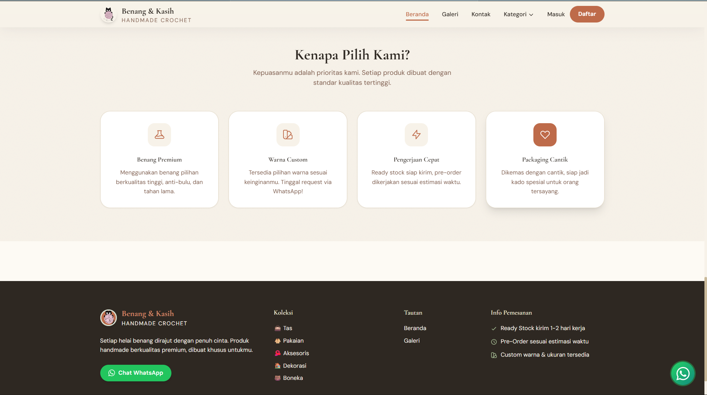
  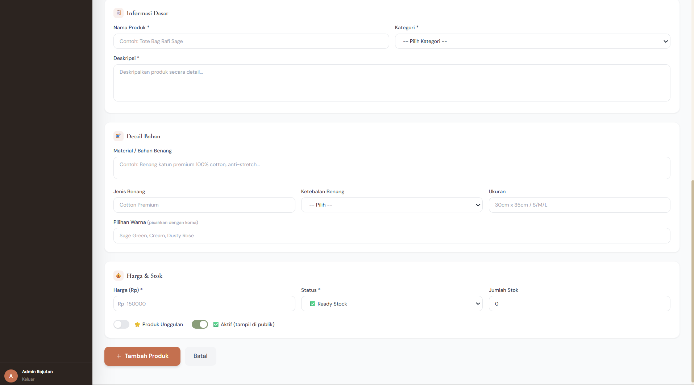
  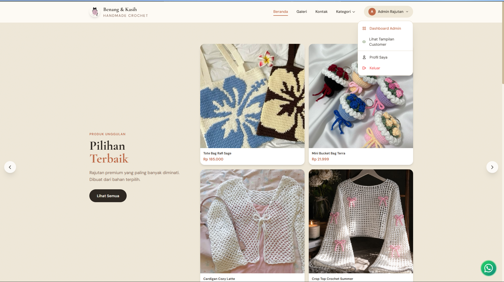
  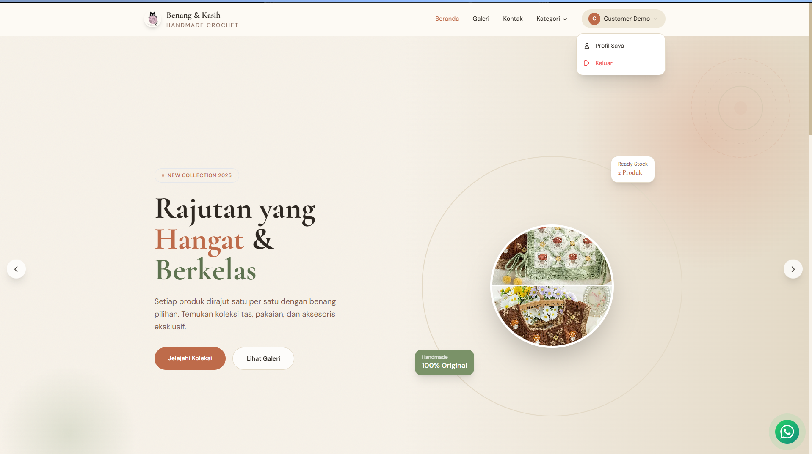
  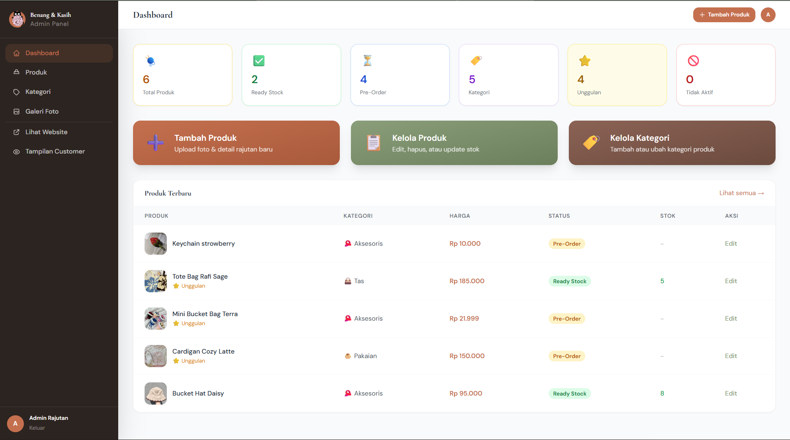
  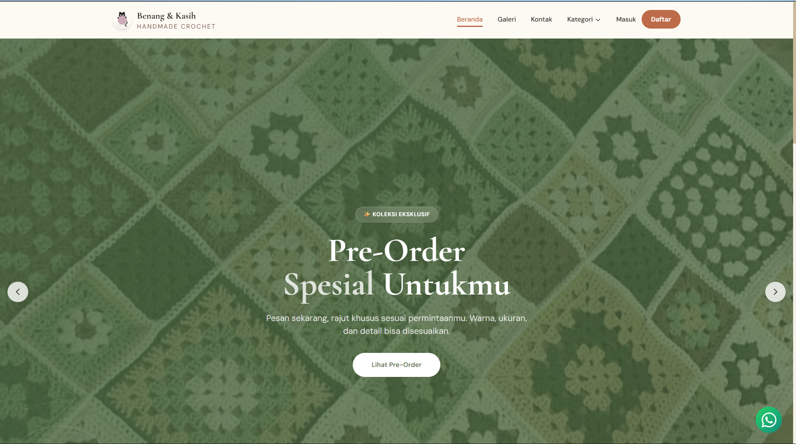
  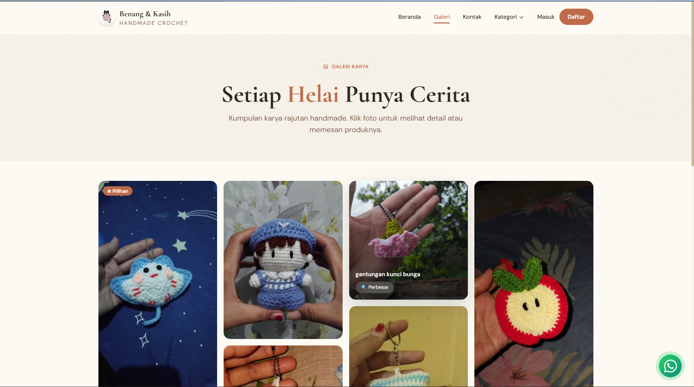
  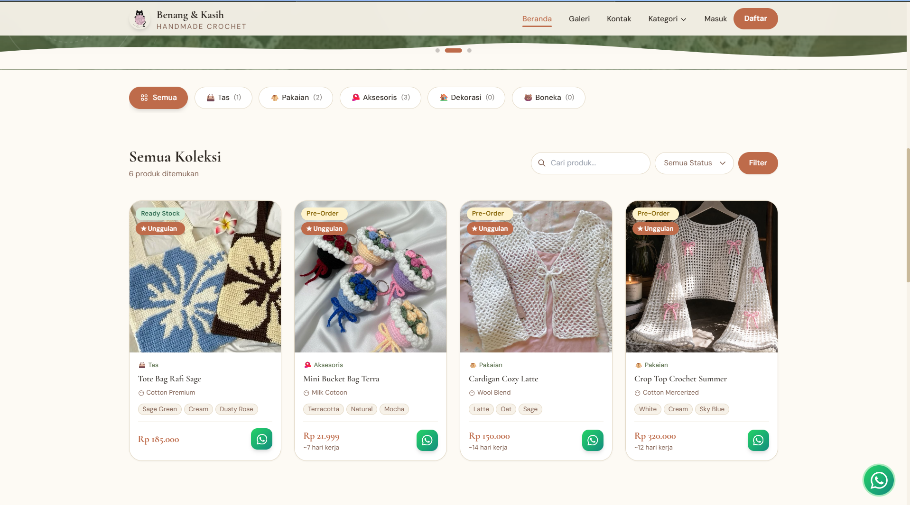
  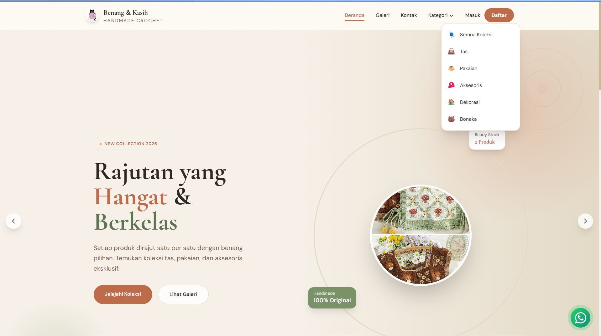
  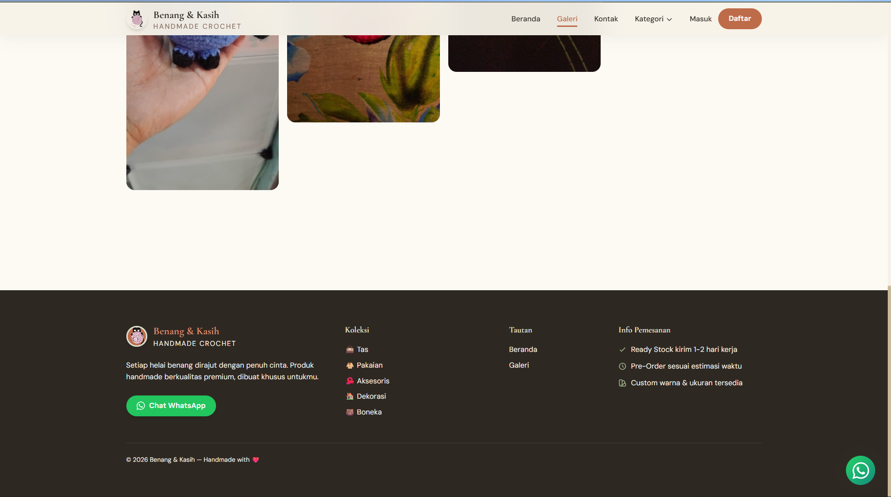
  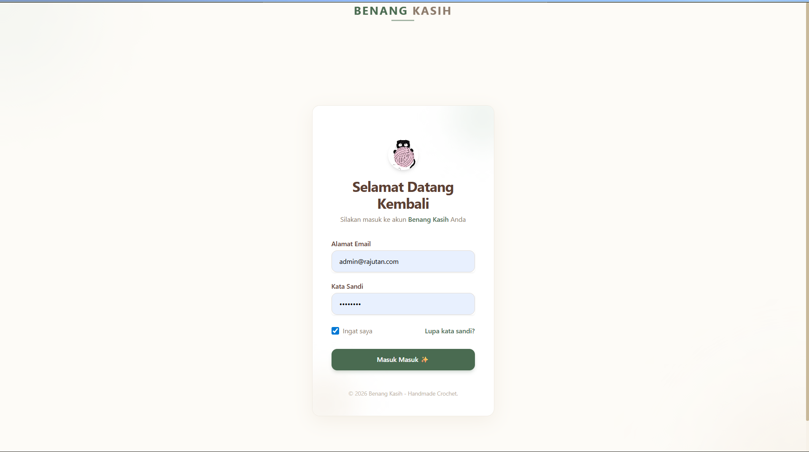
  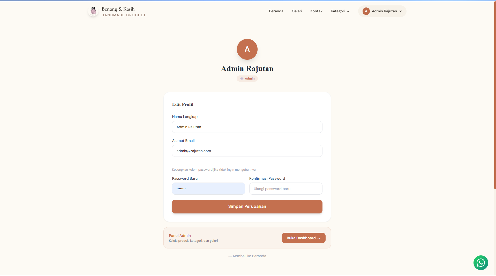
  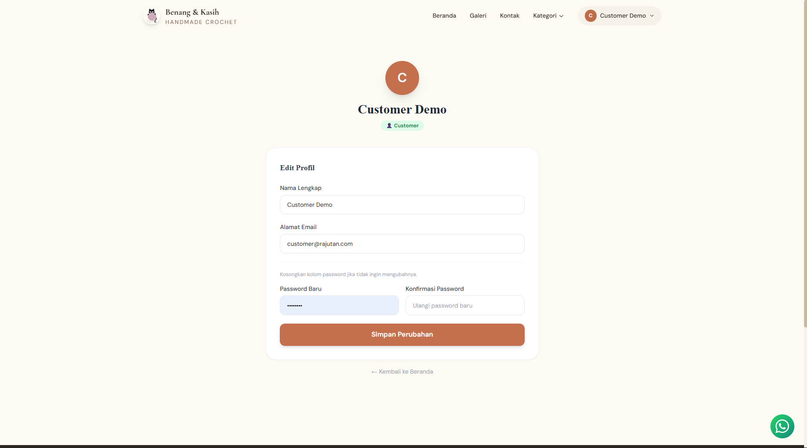
  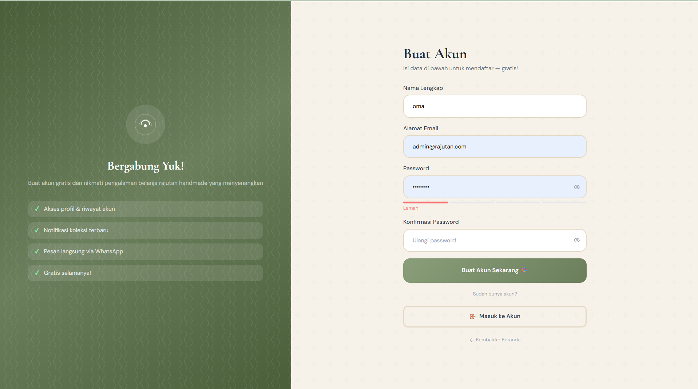
  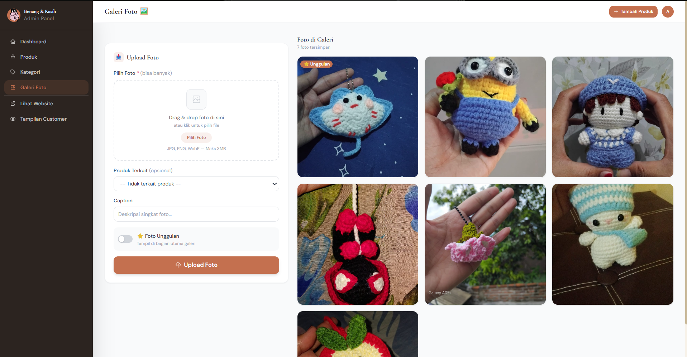
  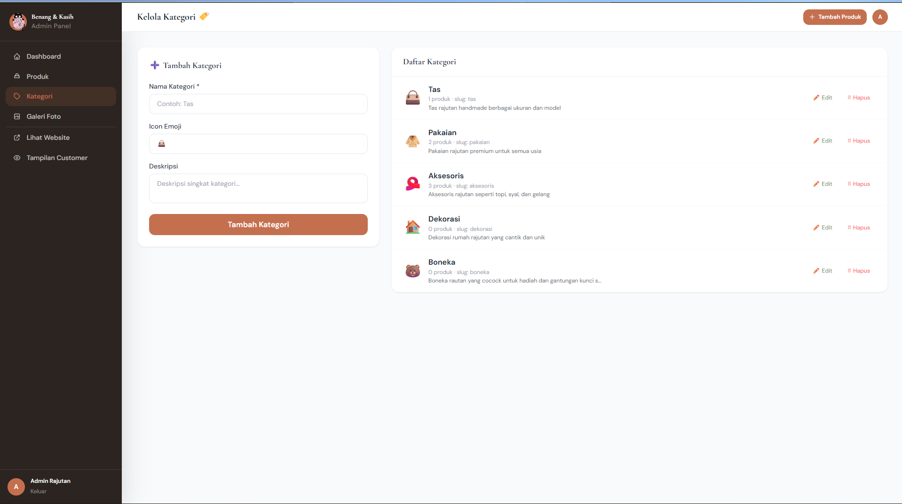
  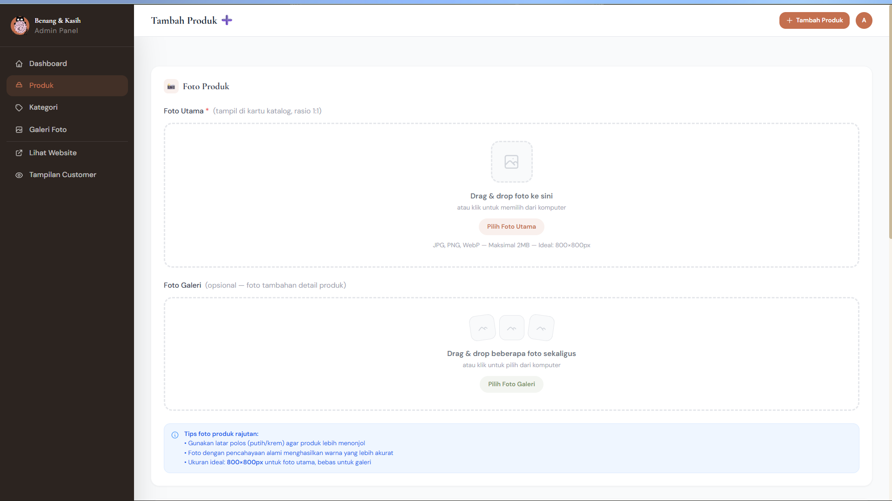
</p>


## 🗄️ Struktur Database

Berikut adalah skema tabel database yang digunakan dalam aplikasi Mobile-POS:

### 1. Tabel `users`
| Kolom | Tipe Data | Keterangan |
| :--- | :--- | :--- |
| `id` | BigInt (PK) | ID unik pengguna |
| `name` | String | Nama pengguna |
| `email` | String | Email pengguna |
| `role` | String | Hak akses (Admin/Kasir) |
| `email_verified_at` | Timestamp | Waktu verifikasi email |
| `password` | String | Password terenkripsi |
| `remember_token` | String | Token sesi |
| `created_at` | Timestamp | Waktu pembuatan |
| `updated_at` | Timestamp | Waktu pembaruan |

### 2. Tabel `categories`
| Kolom | Tipe Data | Keterangan |
| :--- | :--- | :--- |
| `id` | BigInt (PK) | ID unik kategori |
| `name` | String | Nama kategori |
| `slug` | String | URL friendly name |
| `icon` | String | Nama/path icon |
| `description` | Text | Deskripsi kategori |
| `sort_order` | Integer | Urutan tampilan |
| `created_at` | Timestamp | Waktu pembuatan |
| `updated_at` | Timestamp | Waktu pembaruan |

### 3. Tabel `product_images`
| Kolom | Tipe Data | Keterangan |
| :--- | :--- | :--- |
| `id` | BigInt (PK) | ID unik gambar |
| `product_id` | BigInt (FK) | Relasi ke tabel products |
| `image` | String | Path/URL gambar |
| `caption` | String | Judul/keterangan gambar |
| `alt` | String | Teks alternatif |
| `sort_order` | Integer | Urutan tampilan |
| `is_featured` | Boolean | Tandai sebagai gambar utama |
| `created_at` | Timestamp | Waktu pembuatan |
| `updated_at` | Timestamp | Waktu pembaruan |


# Benang & Kasih 🧶

Benang & Kasih adalah platform katalog produk rajutan *handmade* yang dirancang untuk memberikan pengalaman belanja yang hangat, estetik, dan terorganisir. Website ini hadir untuk membantu pelanggan memilih produk rajutan favorit mereka dengan lebih leluasa melalui fitur keranjang belanja sebelum melakukan pemesanan akhir.

Website ini mengusung nuansa *cozy* yang mencerminkan keunikan produk *handmade*, namun tetap mempertahankan performa modern yang responsif. Dengan alur belanja yang intuitif, pelanggan dapat mengumpulkan pilihan produk mereka ke dalam keranjang, meninjau kembali pesanan, dan kemudian mengirimkan daftar pesanan tersebut secara otomatis melalui WhatsApp kepada penjual.

---

# ✨ Keunggulan Website

* **Pengalaman Belanja Teratur:** Fitur keranjang memungkinkan pelanggan memilih banyak produk sekaligus sebelum memesan.
* **Tampilan Estetik:** Desain modern dan *clean* yang menonjolkan keindahan tekstur produk rajutan.
* **Responsif:** Tampilan yang nyaman diakses baik melalui *desktop* maupun *smartphone*.
* **Integrasi WhatsApp:** Mempermudah komunikasi langsung antara penjual dan pembeli dengan detail pesanan yang sudah rapi.
* **Ringan & Cepat:** Performa website optimal untuk kenyamanan pengguna.
* **Tanpa Akun Rumit:** Pelanggan dapat langsung berbelanja tanpa harus melalui proses registrasi yang panjang.

---

# 🚀 Fitur Utama

* **Katalog Produk Interaktif:** *Showcase* produk rajutan dengan detail yang jelas.
* **Sistem Keranjang Belanja:** Fitur tambah ke keranjang untuk mengelola daftar belanja pelanggan sebelum *checkout*.
* **Keranjang ke WhatsApp:** Mengonversi isi keranjang belanja menjadi pesan terformat yang siap dikirim ke WhatsApp penjual.
* **Responsive Mobile Design:** Pengalaman belanja yang mulus di perangkat genggam.
* **Navigasi Sederhana:** Memudahkan pengguna menemukan produk tanpa hambatan.

---

# 🎯 Tujuan Pembuatan Website

Website ini dibuat untuk memberikan pengalaman belanja *online* yang lebih baik bagi pelanggan produk *handmade*. Dengan adanya fitur keranjang, pelanggan dapat membuat daftar pesanan mereka sendiri, sehingga proses transaksi menjadi lebih terstruktur, minim kesalahan, dan mempercepat komunikasi antara pembeli dan penjual melalui integrasi WhatsApp.


