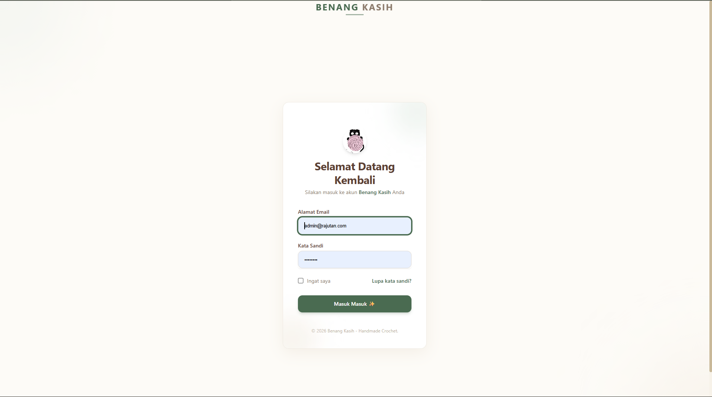
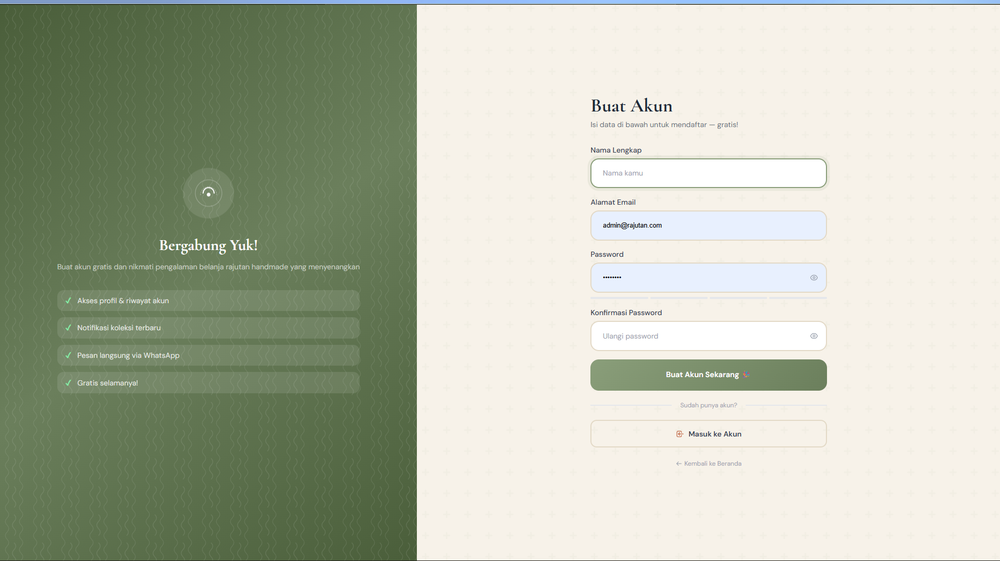
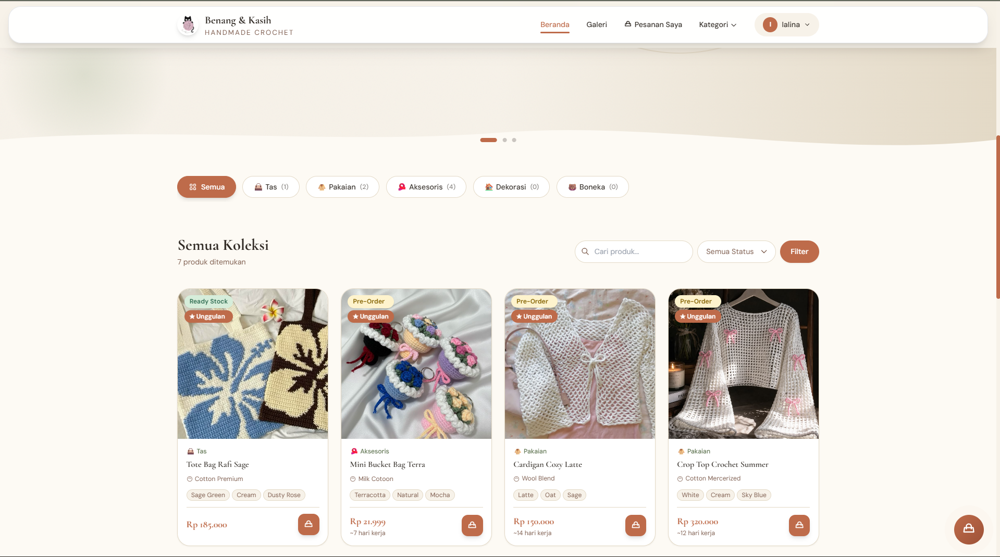
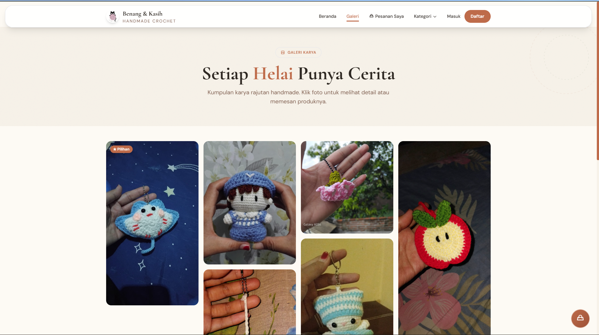
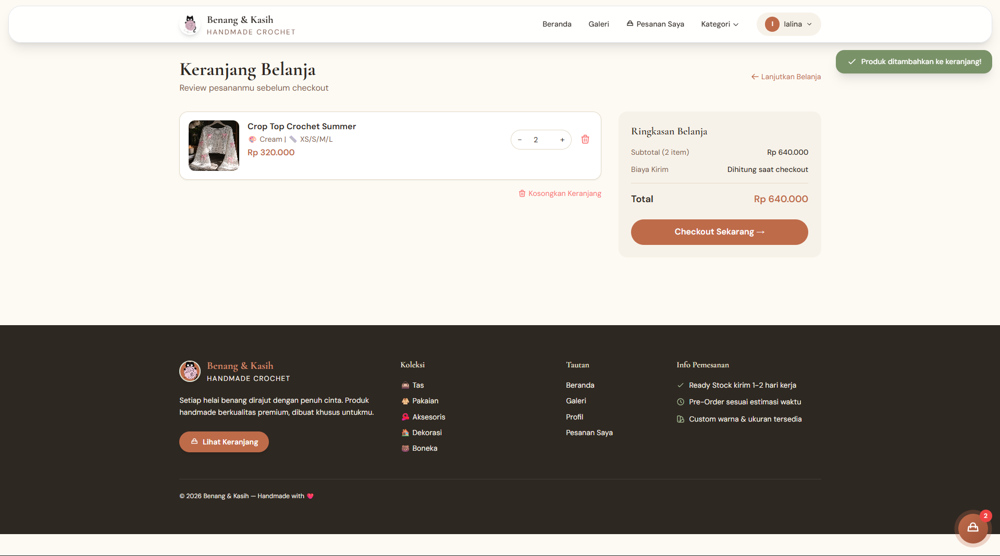
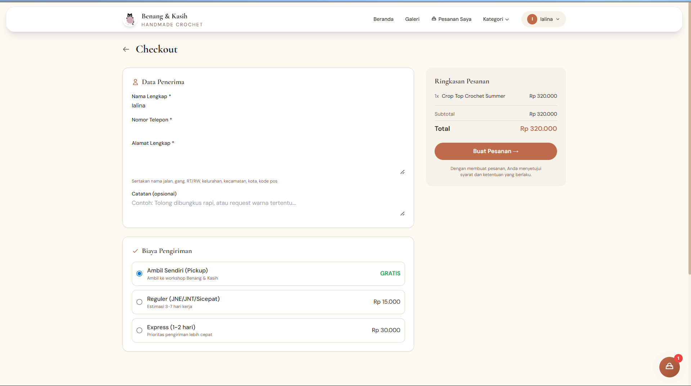
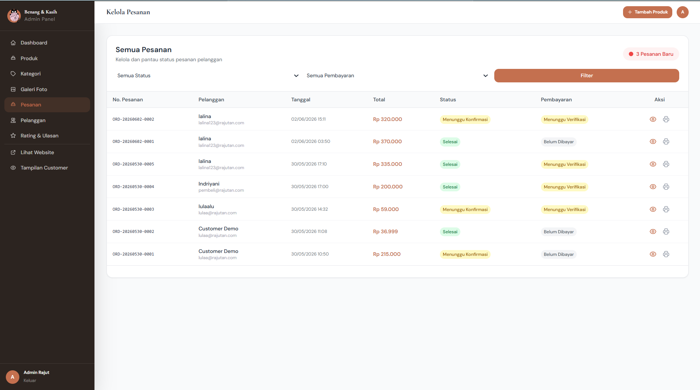
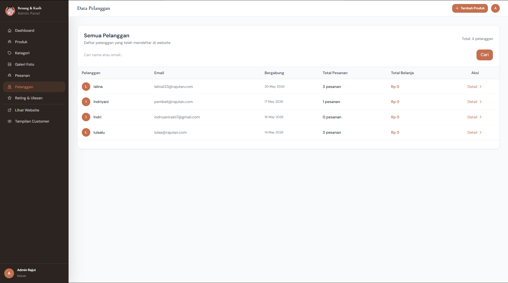
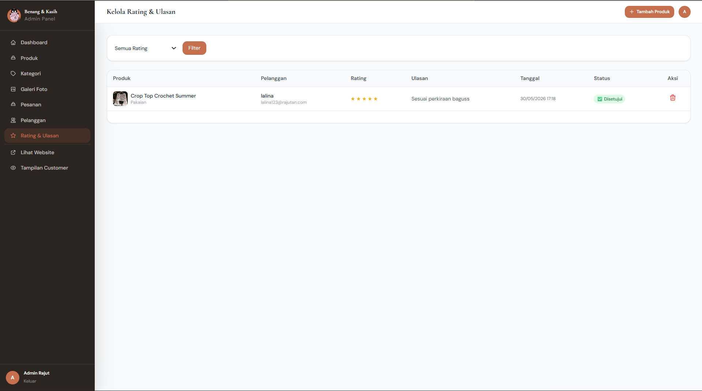
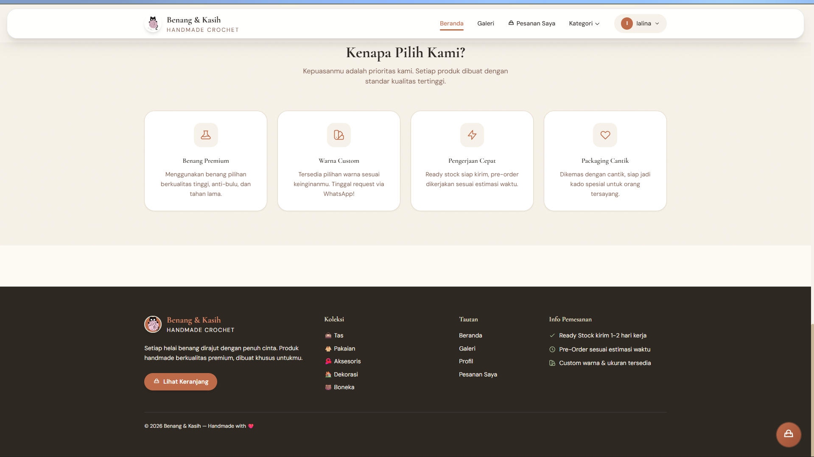

---
## 🖼️ Tampilan Aplikasi

  <!-- Sesi Awal/Autentikasi -->
  
  
  
  <!-- Sesi Dashboard -->
  
  
  
  <!-- Sesi Produk & Katalog -->
  
  
  
  
  
  <!-- Sesi Transaksi -->
  
  
  
  
  
  <!-- Sesi Admin & Pengguna -->
  
  
  
  
  
  
  
  
  

## 🗄️ Struktur Database

Berikut adalah skema tabel database yang digunakan dalam aplikasi Mobile-POS:

### 1. Tabel `users`
| Kolom | Tipe Data | Keterangan |
| :--- | :--- | :--- |
| `id` | BigInt (PK) | ID unik pengguna |
| `name` | String | Nama pengguna |
| `email` | String | Email pengguna |
| `role` | String | Hak akses (Admin/Kasir) |
| `email_verified_at` | Timestamp | Waktu verifikasi email |
| `password` | String | Password terenkripsi |
| `remember_token` | String | Token sesi |
| `created_at` | Timestamp | Waktu pembuatan |
| `updated_at` | Timestamp | Waktu pembaruan |

### 2. Tabel `categories`
| Kolom | Tipe Data | Keterangan |
| :--- | :--- | :--- |
| `id` | BigInt (PK) | ID unik kategori |
| `name` | String | Nama kategori |
| `slug` | String | URL friendly name |
| `icon` | String | Nama/path icon |
| `description` | Text | Deskripsi kategori |
| `sort_order` | Integer | Urutan tampilan |
| `created_at` | Timestamp | Waktu pembuatan |
| `updated_at` | Timestamp | Waktu pembaruan |

### 3. Tabel `galeries`
| Kolom | Tipe Data | Keterangan |
| :--- | :--- | :--- |
| `id` | BigInt (PK) | ID unik gambar |
| `product_id` | BigInt (FK) | Relasi ke tabel products |
| `image` | String | Path/URL gambar |
| `caption` | String | Judul/keterangan gambar |
| `alt` | String | Teks alternatif |
| `sort_order` | Integer | Urutan tampilan |
| `is_featured` | Boolean | Tandai sebagai gambar utama |
| `created_at` | Timestamp | Waktu pembuatan |
| `updated_at` | Timestamp | Waktu pembaruan |

### 4. Tabel `carts`
| Kolom | Tipe Data | Keterangan |
| :--- | :--- | :--- |
| `id` | BigInt (PK) | ID unik cart |
| `user_id` | BigInt (FK) | ID pengguna |
| `product_id` | BigInt (FK) | ID produk |
| `quantity` | Integer | Jumlah barang |
| `selected_colors` | String/JSON | Warna yang dipilih |
| `selected_size` | String | Ukuran yang dipilih |
| `created_at` | Timestamp | Waktu pembuatan |
| `updated_at` | Timestamp | Waktu pembaruan |

### 5. Tabel `order_items`
| Kolom | Tipe Data | Keterangan |
| :--- | :--- | :--- |
| `id` | BigInt (PK) | ID unik item order |
| `order_id` | BigInt (FK) | Relasi ke tabel orders |
| `product_id` | BigInt (FK) | Relasi ke tabel products |
| `product_name` | String | Nama produk saat transaksi |
| `product_price` | Decimal | Harga produk saat transaksi |
| `quantity` | Integer | Jumlah dibeli |
| `selected_color` | String | Warna yang dipilih |
| `selected_size` | String | Ukuran yang dipilih |
| `subtotal` | Decimal | Harga total item |
| `created_at` | Timestamp | Waktu pembuatan |
| `updated_at` | Timestamp | Waktu pembaruan |

### 6. Tabel `rating`
| Kolom | Tipe Data | Keterangan |
| :--- | :--- | :--- |
| `id` | BigInt (PK) | ID unik review |
| `product_id` | BigInt (FK) | Relasi ke tabel products |
| `user_id` | BigInt (FK) | Relasi ke tabel users |
| `order_id` | BigInt (FK) | Relasi ke tabel orders |
| `rating` | Integer | Nilai bintang (1-5) |
| `review` | Text | Isi ulasan |
| `is_approved` | Boolean | Status persetujuan admin |
| `created_at` | Timestamp | Waktu pembuatan |
| `updated_at` | Timestamp | Waktu pembaruan |

### 7. Tabel `orders`
| Kolom | Tipe Data | Keterangan |
| :--- | :--- | :--- |
| `id` | BigInt (PK) | ID unik pesanan |
| `order_number` | String | Nomor pesanan[cite: 1] |
| `user_id` | BigInt (FK) | ID pengguna[cite: 1] |
| `status` | String | Status pesanan[cite: 1] |
| `customer_name` | String | Nama pelanggan[cite: 1] |
| `customer_phone` | String | Nomor telepon pelanggan[cite: 1] |
| `shipping_address` | Text | Alamat pengiriman[cite: 1] |
| `notes` | Text | Catatan pesanan[cite: 1] |
| `subtotal` | Decimal | Subtotal harga |
| `shipping_cost` | Decimal | Biaya pengiriman |
| `total` | Decimal | Total biaya |
| `payment_status` | String | Status pembayaran |
| `payment_proof` | String | Bukti pembayaran |
| `paid_at` | Timestamp | Waktu pembayaran |
| `shipping_courier` | String | Kurir pengiriman |
| `tracking_number` | String | Nomor resi/pelacakan |
| `shipped_at` | Timestamp | Waktu pengiriman |
| `delivered_at` | Timestamp | Waktu barang diterima |
| `admin_notes` | Text | Catatan admin |
| `created_at` | Timestamp | Waktu pembuatan |
| `updated_at` | Timestamp | Waktu pembaruan |

### Tabel `products`
| Kolom | Keterangan |
| :--- | :--- |
| `id` | ID unik produk |
| `category_id` | ID kategori[cite: 1] |
| `name` | Nama produk[cite: 1] |
| `slug` | URL friendly name[cite: 1] |
| `description` | Deskripsi produk[cite: 1] |
| `material` | Bahan produk[cite: 1] |
| `yarn_type` | Jenis benang[cite: 1] |
| `yarn_weight` | Berat benang[cite: 1] |
| `price` | Harga produk[cite: 1] |
| `status` | Status produk[cite: 1] |
| `stock` | Jumlah stok[cite: 1] |
| `estimated_days` | Estimasi hari pengerjaan[cite: 1] |
| `size` | Ukuran produk[cite: 1] |
| `colors` | Pilihan warna[cite: 1] |
| `image` | Gambar utama produk[cite: 1] |
| `gallery` | Galeri gambar produk[cite: 1] |
| `is_featured` | Tanda produk unggulan[cite: 1] |
| `is_active` | Status aktif produk[cite: 1] |
| `sort_order` | Urutan tampilan[cite: 1] |
| `created_at` | Waktu pembuatan[cite: 1] |
| `updated_at` | Waktu pembaruan[cite: 1] |

# Benang & Kasih 🧶

Benang & Kasih adalah platform katalog produk rajutan *handmade* yang dirancang untuk memberikan pengalaman belanja yang hangat, estetik, dan terorganisir. Website ini hadir untuk membantu pelanggan memilih produk rajutan favorit mereka dengan lebih leluasa melalui fitur keranjang belanja sebelum melakukan pemesanan akhir.

Website ini mengusung nuansa *cozy* yang mencerminkan keunikan produk *handmade*, namun tetap mempertahankan performa modern yang responsif. Dengan alur belanja yang intuitif, pelanggan dapat mengumpulkan pilihan produk mereka ke dalam keranjang, meninjau kembali pesanan, dan kemudian mengirimkan daftar pesanan tersebut secara otomatis melalui WhatsApp kepada penjual.

---

# ✨ Keunggulan Website

* **Pengalaman Belanja Teratur:** Fitur keranjang memungkinkan pelanggan memilih banyak produk sekaligus sebelum memesan.
* **Tampilan Estetik:** Desain modern dan *clean* yang menonjolkan keindahan tekstur produk rajutan.
* **Responsif:** Tampilan yang nyaman diakses baik melalui *desktop* maupun *smartphone*.
* **Integrasi WhatsApp:** Mempermudah komunikasi langsung antara penjual dan pembeli dengan detail pesanan yang sudah rapi.
* **Ringan & Cepat:** Performa website optimal untuk kenyamanan pengguna.
* **Tanpa Akun Rumit:** Pelanggan dapat langsung berbelanja tanpa harus melalui proses registrasi yang panjang.

---

# 🚀 Fitur Utama

* **Katalog Produk Interaktif:** *Showcase* produk rajutan dengan detail yang jelas.
* **Sistem Keranjang Belanja:** Fitur tambah ke keranjang untuk mengelola daftar belanja pelanggan sebelum *checkout*.
* **Keranjang ke WhatsApp:** Mengonversi isi keranjang belanja menjadi pesan terformat yang siap dikirim ke WhatsApp penjual.
* **Responsive Mobile Design:** Pengalaman belanja yang mulus di perangkat genggam.
* **Navigasi Sederhana:** Memudahkan pengguna menemukan produk tanpa hambatan.

---

# 🎯 Tujuan Pembuatan Website

Website ini dibuat untuk memberikan pengalaman belanja *online* yang lebih baik bagi pelanggan produk *handmade*. Dengan adanya fitur keranjang, pelanggan dapat membuat daftar pesanan mereka sendiri, sehingga proses transaksi menjadi lebih terstruktur, minim kesalahan, dan mempercepat komunikasi antara pembeli dan penjual melalui integrasi WhatsApp.

